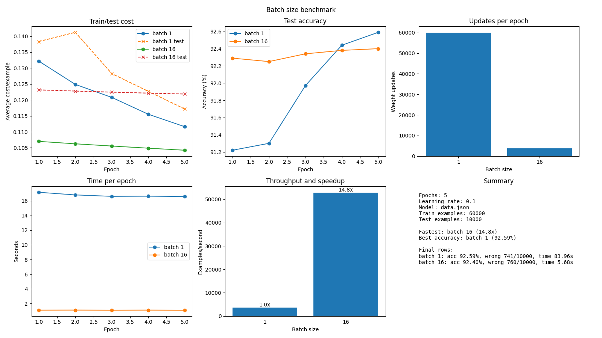

# Neural Network from Scratch

This project implements a fully connected feedforward neural network from first principles in Python, without using machine learning frameworks for the network itself.
It uses the MNIST dataset to recognise handwritten digits.

I built this as a learning tool to understand matrix-based gradient descent from scratch. The first version was written in 2023 completely blind, using only 3Blue1Brown's maths tutorial videos on neural networks and gradient descent as guidance, especially [Gradient descent, how neural networks learn](https://www.youtube.com/watch?v=IHZwWFHWa-w).

---

## Features

- Matrix-based forward propagation and backpropagation
- Gradient descent weight updates with training support
- Custom sigmoid activation and cost functions
- Configurable network architecture and hyperparameters
- Model saving/loading with JSON

---

## Design Notes

The core network is intentionally written around arrays and matrix operations:

- each layer stores a weight matrix and bias vector
- forward propagation uses `weights @ activation + bias`
- backpropagation uses matrix products, transposes, element-wise sigmoid derivatives, and gradient updates

That makes the project a good candidate for a GPU version with CuPy. In principle, most NumPy calls in the core math can be swapped for CuPy equivalents because CuPy mirrors much of the NumPy API and runs those array operations on the GPU.

A GPU version should still be designed carefully around data movement. The important rule is to keep arrays on the GPU during training instead of repeatedly converting between NumPy arrays and CuPy arrays. The algorithm does not need to be redesigned around manual parallelism; the matrix operations already expose parallel work, and CuPy delegates that work to CUDA kernels. The main redesign is therefore an array-backend layer, for example choosing `numpy` or `cupy` as `xp`, plus explicit conversion when loading JSON, saving JSON, or interacting with TensorFlow/Keras data.

## GPU Processing

The network supports NumPy for CPU execution and CuPy for CUDA GPU execution. The full MNIST comparison produced identical training results, but NumPy was `3.9x` faster for the current small model. See the [CPU and GPU performance report](docs/gpu-performance-report.md), [medium-model GPU follow-up](docs/gpu-medium-model-follow-up.md), and [benchmark methodology](docs/benchmark-methodology.md) for results, hardware tradeoffs, and fair comparison guidance.

Install a CuPy wheel matching the installed CUDA runtime. For current CUDA 12 systems:

```powershell
pip install -r requirements-gpu.txt
```

Run an individual GPU training or test job with `--backend cupy`:

```powershell
python src/main.py --train --backend cupy --model models/fresh.json --epochs 5 --batch-size 256
```

To reproduce the comparison:

```powershell
python src/main.py --benchmark-batches --backends numpy,cupy --epochs 5 --learning-rate 0.1 --batch-sizes 256 --benchmark-output outputs/numpy_vs_cupy_full_summary.csv --benchmark-history-output outputs/numpy_vs_cupy_full_history.csv --benchmark-plot docs/assets/numpy_vs_cupy_full_stats.png
```

To benchmark a wider model with warmed, repeated runs, first create a seeded Xavier-initialised model:

```powershell
python src/randomiser.py models/medium.json --structure 784,512,512,10 --seed 42
python src/main.py --benchmark-batches --model models/medium.json --structure 784,512,512,10 --backends numpy,cupy --batch-sizes 256,1024,2048 --epochs 1 --benchmark-runs 3
```

---

## Batch Processing

The original training loop updated the model after every image. With per-image processing, one MNIST example is reshaped into a column vector, passed through the network, backpropagated, and immediately used to update the weights.

Mini-batch processing groups multiple images into one matrix. For example, batch size `16` turns sixteen `(784,)` inputs into a single `(784, 16)` activation matrix internally. The same matrix-based forward and backward equations still apply, but each update uses the average gradient from sixteen examples instead of one example.

This matters because the expensive work is matrix multiplication. Doing more examples per matrix operation reduces Python loop overhead and gives NumPy larger, more efficient array operations to run. It also matches the shape of the later GPU/CuPy version: fewer, larger matrix operations are much better for GPU acceleration than many tiny per-image operations.

Full MNIST benchmark, using `60,000` training examples, `10,000` test examples, 5 epochs, and learning rate `0.1`:



| Batch size | Processing style | Weight updates | Total time | Examples/sec | Test accuracy |
|---:|---|---:|---:|---:|---:|
| 1 | per-image update | 300,000 | 83.96s | 3,573.20 | 92.59% |
| 16 | mini-batch update | 18,750 | 5.68s | 52,850.24 | 92.40% |

Batch size `16` was about `14.8x` faster in this run while keeping almost the same accuracy. The per-image version made more frequent updates and ended slightly higher on accuracy, but it took far longer. The mini-batch version is usually the better trade-off when the goal is efficient training, especially as the project moves toward a GPU backend.

---

## Project Structure

- `src/main.py` - Command-line entry point for training, testing, and benchmarking
- `src/dependencies.py` - Core neural network layers and matrix operations
- `src/data.py` - Model validation, model JSON loading/saving, and MNIST loading
- `src/training.py` - Shared training, evaluation, batching, and metric plotting helpers
- `src/benchmark.py` - Batch-size benchmark recording and graph generation
- `src/randomiser.py` - Random weight initialisation module
- `data.json` - Example saved weights
- `requirements.txt` - Python package dependencies

---

## Quickstart

Copy and paste this into PowerShell from the project folder:

```powershell
# Create and activate a local virtual environment
python -m venv .venv
.venv\Scripts\activate

# Install Python dependencies
pip install -r requirements.txt

# Create, train, and test a fresh random model
python src/randomiser.py models/fresh.json
python src/main.py --train --model models/fresh.json --epochs 1 --learning-rate 0.1
python src/main.py --test --model models/fresh.json
```

To test the included saved model only:

```powershell
python src/main.py --test
```

---

## Usage

### `main.py`

Train or test a saved model file. By default, this uses `data.json`.
Training saves updated weights and biases back to the selected model file.

```bash
python src/main.py --test
python src/main.py --train
```

Training defaults to 30 epochs and a learning rate of 0.1:

```bash
python src/main.py --train --epochs 10 --learning-rate 0.05
```

Useful flags:

- `--test` - Evaluate a model against the MNIST test set
- `--train` - Train a model and save updated weights/biases
- `--benchmark-batches` - Compare training cost, timing, throughput, and test accuracy across batch sizes
- `--backend BACKEND` - Use `numpy` (CPU, default) or `cupy` (CUDA GPU) for training or testing
- `--backends LIST` - Comma-separated backends for `--benchmark-batches`, for example `numpy,cupy`
- `--structure LAYERS` - Comma-separated MNIST layer sizes, for example `784,512,512,10`
- `--model PATH` - Load/save a specific model file
- `--epochs N` - Number of training epochs
- `--learning-rate VALUE` - Training learning rate
- `--batch-size N` - Number of examples per training update
- `--batch-sizes LIST` - Comma-separated batch sizes for benchmarking, for example `1,8,32,128`
- `--cpu-batch-sizes LIST` - Optional NumPy-only batch-size sweep for best-tested CPU throughput
- `--gpu-batch-sizes LIST` - Optional CuPy-only batch-size sweep for best-tested GPU throughput
- `--benchmark-train-limit N` - Limit benchmark training examples for quicker comparisons
- `--benchmark-test-limit N` - Limit benchmark test examples for quicker comparisons
- `--benchmark-runs N` - Recorded runs per backend and batch size; defaults to 3
- `--benchmark-warmup-batches N` - Unrecorded CuPy warm-up batches before each run; defaults to 1
- `--benchmark-output PATH` - Save benchmark summary stats as CSV
- `--benchmark-history-output PATH` - Save per-epoch benchmark stats as CSV
- `--benchmark-plot PATH` - Save benchmark comparison graphs
- `--verbose` - Print model details and every test prediction
- `--show-tf-logs` - Show TensorFlow startup logs

Train with mini-batches:

```bash
python src/main.py --train --model models/fresh.json --epochs 5 --learning-rate 0.1 --batch-size 32
```

Benchmark different batch sizes from the same starting model:

```bash
python src/main.py --benchmark-batches --model models/fresh.json --epochs 1 --batch-sizes 1,8,16,32,64,128
```

By default, benchmark results are saved to:

- `outputs/batch_benchmark_summary.csv`
- `outputs/batch_benchmark_history.csv`
- `outputs/batch_benchmark_stats.png`

For a quick benchmark while experimenting, limit the dataset:

```bash
python src/main.py --benchmark-batches --model models/fresh.json --epochs 1 --batch-sizes 1,16,64,256 --benchmark-train-limit 5000 --benchmark-test-limit 1000
```

### `randomiser.py`

Create a new random model file:

```bash
python src/randomiser.py models/fresh.json
```

Existing model files are protected by default. To overwrite one, pass `--force` and confirm the prompt:

```bash
python src/randomiser.py models/fresh.json --force
```

The scripts download MNIST through TensorFlow/Keras if needed. TensorFlow startup logs are hidden by default during `main.py` runs.
