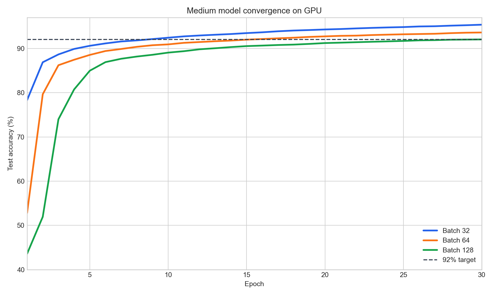
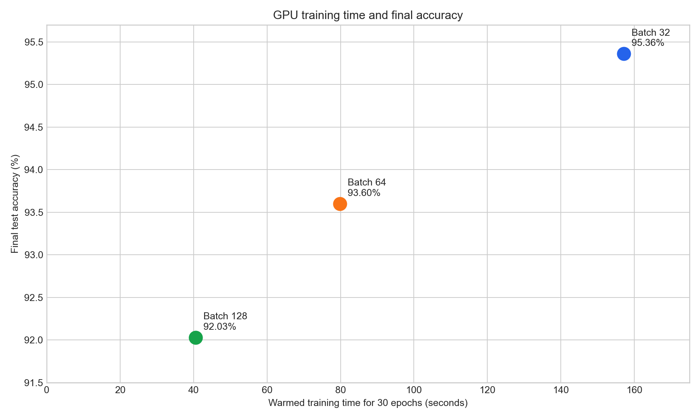

# Medium-Model Quality Training

## Purpose

This experiment measures how longer training and smaller practical mini-batches affect the accuracy of a fresh `[784, 512, 512, 10]` model on the CuPy GPU backend.

The model used Xavier initialisation, a learning rate of `0.1`, and `30` epochs. Each configuration started from the same seeded weights.

## Accuracy Over Time

Batch size `32` passed `92%` test accuracy in epoch `9` and reached `95.36%` at epoch `30`. The smaller batch makes more parameter updates per epoch, which improves convergence at the cost of lower throughput.

## Time and Accuracy Trade-off

| Batch size | Weight updates | Final accuracy | Training time | Throughput |
|---:|---:|---:|---:|---:|
| 32 | 56,250 | 95.36% | 157.11s | 11,456.93 examples/sec |
| 64 | 28,140 | 93.60% | 79.88s | 22,532.71 examples/sec |
| 128 | 14,070 | 92.03% | 40.61s | 44,325.76 examples/sec |

Choose batch `32` when the priority is highest measured accuracy in this experiment. Choose batch `128` when `92%` is sufficient and shorter training time matters. These results apply to this architecture, dataset, epoch count, and learning rate; batch size and learning rate should be tuned together for other workloads.

Raw records are in `outputs/gpu_medium_quality_gpu_summary.csv` and `outputs/gpu_medium_quality_gpu_history.csv`.