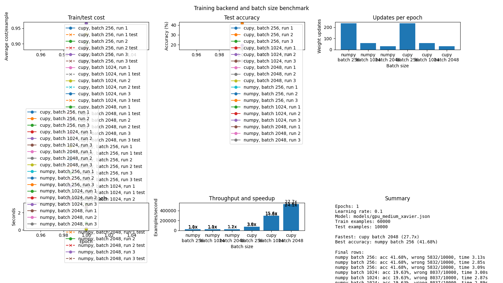

# Medium-Model GPU Benchmark Follow-Up

## Purpose

This follow-up executes the plan in the [CPU and GPU performance report](gpu-performance-report.md): increase the network width, use float32 arrays, keep benchmark data on the selected backend, warm up CuPy, and measure repeated runs.

## Configuration

The benchmark used the full MNIST dataset for one epoch with a Xavier-initialized, seeded `[784, 512, 512, 10]` network. It ran on the same NVIDIA GeForce RTX 3060 and compared NumPy CPU execution with CuPy GPU execution from identical initial weights.

- Train examples: `60,000`
- Test examples: `10,000`
- Learning rate: `0.1`
- Recorded runs per configuration: `3`
- CuPy warm-up batches before each run: `1`
- Data type: `float32`

## Results

| Batch size | NumPy median examples/sec | CuPy median examples/sec | CuPy advantage | Matching test accuracy |
|---:|---:|---:|---:|---:|
| 256 | 19,434.68 | 72,329.84 | 3.7x | 41.68% |
| 1024 | 20,771.66 | 294,824.94 | 14.2x | 19.63% |
| 2048 | 21,818.94 | 490,936.90 | 22.5x | 16.36% |

CuPy was faster at every tested batch size. At batch size `2048`, its median throughput was `22.5x` higher than NumPy's. CPU and GPU runs reached the same final accuracy and cost for every matching configuration, so the difference is a performance crossover rather than a change in training semantics.

## Why the GPU Won

The medium network has roughly `669,000` weights, compared with `12,960` in the original network. The larger dense matrix multiplications provide enough work per CUDA launch for the RTX 3060 to amortize launch overhead and use its parallel capacity. Larger batches reduce the number of updates and launches per epoch, which increases the GPU advantage further.

## Benchmarking Changes

The implementation now supports the conditions used in this experiment:

- `--structure` configures MNIST-compatible layer sizes.
- `randomiser.py` accepts `--seed` and defaults to Xavier initialization.
- Model parameters, MNIST inputs, targets, activations, and gradients use float32.
- Benchmarks move each dataset to its selected backend once.
- `--benchmark-runs` defaults to three and CuPy warm-up is controlled by `--benchmark-warmup-batches`.
- Summary CSV rows include median, minimum, and maximum duration values.

Raw records are written to `outputs/gpu_medium_summary.csv` and `outputs/gpu_medium_history.csv`. The low one-epoch accuracies should not be compared directly with the earlier five-epoch small-model result; longer accuracy benchmarks should tune the learning rate for each batch-size regime.